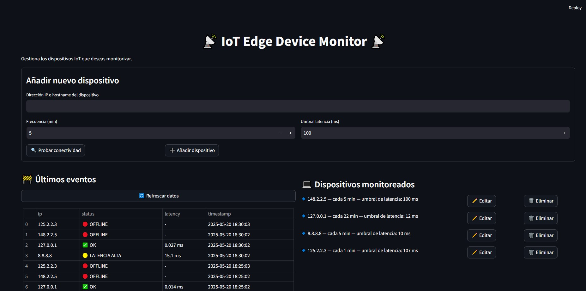

# 🚀 IoT Edge Network Monitoring System

## ✅ Descripción

**IoT Edge Network Monitoring System** es una aplicación educativa, modular y dockerizada que simula el comportamiento de un *Edge Gateway Linux* para la monitorización de dispositivos IoT conectados en una red local.

Este sistema permite al usuario:
- Registrar dispositivos (IPs o hostnames),
- Configurar frecuencia de chequeo y umbrales de latencia,
- Visualizar el estado actual desde un panel web,
- Automatizar los chequeos periódicos con cron en segundo plano,
- Guardar logs estructurados y exportables.

> 💡 Pensado como base escalable para futuros proyectos en entornos de **IoT, 5G e Inteligencia Artificial**, incluyendo trabajos de investigación o TFM.

---

## 🖼️ Vista previa

📷 A continuación se muestra una captura del panel principal desarrollado en Streamlit, donde se pueden registrar dispositivos, ver su estado y lanzar tareas de monitorización manual o automática:

> 

---

## 🎯 Funcionalidades principales

- ✅ Registro de dispositivos IoT desde interfaz web.
- 🕓 Configuración de frecuencia de monitorización individual.
- 📶 Test de conectividad (ping) en tiempo real.
- 📊 Visualización del estado actual de cada dispositivo.
- 🔁 Automatización de chequeos con tareas cron.
- 📁 Logs persistentes accesibles desde la UI.
- ✏️ Edición y eliminación de dispositivos configurados.

---

## 🧩 Arquitectura

El sistema está compuesto por dos contenedores que se comunican por red interna Docker:

[ Streamlit UI ] <--------> shared-data (config/devices.json + logs) <--------> [ Monitor Engine (AlmaLinux + Shell) ]

- `streamlit_ui`: Interfaz de usuario en Streamlit (Python)
- `monitor_engine`: Motor de monitorización en Bash, ejecutado automáticamente vía cron

---

## 🛠️ Tecnologías utilizadas

- **Linux** (WSL2 con Ubuntu y contenedores AlmaLinux)
- **Docker + Docker Compose**
- **Streamlit** (Python 3.10)
- **Shell scripting** (Bash)
- **cronie / cron** para automatización
- **jq / iputils-ping** para parseo de JSON y chequeos de red
- **Redes TCP/IP** (ping, latencia, resolución de DNS)

---

## 🧪 Cómo probarlo

1. Clona este repositorio:

```bash
git clone https://github.com/Jotaaaaaaa7/IoT_Edge_Network_Monitoring_System.git
cd iot-edge-monitor
docker compose up --build
```
Abre la aplicación en tu navegador:
👉 http://localhost:8501

Registra uno o más dispositivos, define su frecuencia y umbral, ¡y comienza a monitorizarlos!

## 📜 Licencia
Este proyecto está licenciado bajo la Licencia MIT.
Consulta el archivo LICENSE para más detalles.

## 🤝 Contribuciones
Este es un proyecto educativo abierto.
Se aceptan mejoras, ideas, sugerencias o Pull Requests para seguir evolucionando el sistema hacia entornos reales de 
investigación y desarrollo en IoT + AI + 5G.

## 📌 Futuras ampliaciones (sugerencias)
- Exportación de logs a CSV / JSON.
- Alerta por email / webhook cuando un dispositivo crítico falla.
- Dashboard histórico con métricas gráficas.
- Integración con bases de datos y herramientas de AI/ML para análisis predictivo.
- Soporte para protocolos industriales (MQTT, Modbus...).